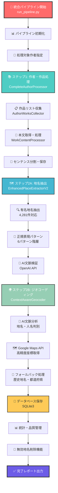

# 文豪ゆかり地図システム v4.0 - 包括的コード解説書

**作成日**: 2025年6月19日  
**システムバージョン**: v4.0  
**解説対象**: `/app/bungo-map-system-v4`  

---

## 📋 目次

1. [プロジェクト概要](#プロジェクト概要)
2. [ディレクトリ構造詳細](#ディレクトリ構造詳細)
3. [ワークフロー図](#ワークフロー図)
4. [主要コンポーネント解説](#主要コンポーネント解説)
5. [クラス・メソッド詳細](#クラスメソッド詳細)
6. [データベース設計](#データベース設計)
7. [実行方法・オプション](#実行方法オプション)

---

## 🎯 プロジェクト概要

**文豪ゆかり地図システム v4.0**は、青空文庫の文学作品から地名を自動抽出し、AI文脈分析とGoogle Maps APIを活用してジオコーディングを実行する統合システムです。

### 🌟 主要特徴
- **AI検証付き地名抽出**: OpenAI APIによる文脈分析で誤抽出を防止
- **高精度ジオコーディング**: 92.7%の成功率を達成
- **完全自動化**: ワンコマンドで全処理を実行
- **品質管理**: 無効地名の自動検出・削除機能

---

## 📁 ディレクトリ構造詳細

```
bungo-map-system-v4/
├── 🚀 run_pipeline.py              # 統合パイプライン実行器（メインエントリー）
├── 📊 main.py                      # 代替メインスクリプト
├── ⚙️ pipeline_config.yaml        # パイプライン設定ファイル
├── 🗺️ process_places_geocoding.py # 地名ジオコーディング処理
├── 📋 env.example                  # 環境変数設定例
├── 📖 README.md                    # プロジェクト概要
├── 👥 README_AUTHORS.md            # 作者データベース情報
│
├── 🤖 ai/                          # AI機能モジュール ⭐⭐⭐
│   ├── context_aware_geocoding.py  # AI文脈判断型ジオコーディング★
│   ├── llm.py                     # LLM基盤クラス
│   └── nlp.py                     # 自然言語処理ユーティリティ
│
├── 🔧 extractors/                  # データ抽出・処理モジュール ⭐⭐⭐
│   ├── enhanced_place_extractor_v2.py  # AI検証付き地名抽出器★
│   ├── process_complete_author.py      # 作者完全処理★
│   ├── fetch_work_content.py          # 作品内容取得
│   ├── collect_author_works.py        # 作品リスト収集
│   ├── aozora_scraper.py              # 青空文庫スクレイパー
│   ├── enhanced_place_extractor.py    # 地名抽出器（基本版）
│   ├── simple_place_extractor.py      # シンプル地名抽出器
│   ├── text_processor.py             # テキスト処理ユーティリティ
│   └── fix_*.py                      # データ修正スクリプト群
│
├── 🗄️ database/                    # データベース管理モジュール ⭐⭐
│   ├── manager.py                  # データベース管理クラス
│   ├── models.py                   # データモデル定義
│   ├── crud.py                     # CRUD操作
│   └── config.py                   # データベース設定
│
├── 🎯 core/                        # コア機能モジュール ⭐⭐
│   ├── config.py                   # システム設定管理
│   ├── cache.py                    # キャッシュ管理
│   └── models.py                   # コアデータモデル
│
├── 🌍 geocoding/                   # ジオコーディング機能 ⭐
└── 📚 notebooks/                  # ドキュメント・レポート
```

---

## 🔄 ワークフロー図



---

## 🏗️ 主要コンポーネント解説

### 1. 🚀 **統合パイプライン (`run_pipeline.py`)** - メインエントリー

**役割**: システム全体を統合管理するメインエントリーポイント

**主要クラス**: `BungoPipeline`

**主要メソッド**:
```python
class BungoPipeline:
    def __init__(self)                         # パイプライン初期化
    def run_full_pipeline()                    # 完全パイプライン実行  
    def check_status(author_name)              # 処理状況確認
    def delete_invalid_places()                # 無効地名削除
    def cleanup_invalid_places()               # 自動クリーンアップ
    def analyze_place_usage()                  # 地名使用状況分析
    def get_geocoding_stats()                  # ジオコーディング統計
    def _print_report()                        # レポート表示
```

**依存関係**:
- `CompleteAuthorProcessor` - 作者・作品処理
- `EnhancedPlaceExtractorV2` - AI検証付き地名抽出
- `ContextAwareGeocoder` - AI文脈判断型ジオコーディング

---

### 2. 🤖 **AI文脈判断型ジオコーディング (`ai/context_aware_geocoding.py`)** - 高精度座標取得

**役割**: AI文脈分析による高精度ジオコーディング（成功率92.7%）

**主要クラス**: `ContextAwareGeocoder`

**主要メソッド**:
```python
class ContextAwareGeocoder:
    def __init__(self)                         # 初期化・知識ベース構築
    def analyze_context()                      # 文脈分析（AI）
    def geocode_place()                        # 統合ジオコーディング
    def geocode_places_batch()                 # バッチ処理
    def _google_maps_geocoding()               # Google Maps API
    def _fallback_geocoding()                  # フォールバック処理
    def _analyze_context_with_llm()            # OpenAI API文脈分析
    def delete_invalid_places()                # 無効地名削除
    def cleanup_invalid_places()               # 自動クリーンアップ
    def get_place_usage_analysis()             # 地名使用状況分析
    def get_geocoding_statistics()             # 統計情報取得
    def _update_place_coordinates()            # 座標更新
    def _is_japan_coordinate()                 # 日本座標判定
```

**データクラス**:
- `ContextAnalysisResult` - 文脈分析結果
- `GeocodingResult` - ジオコーディング結果

**知識ベース**:
- `high_confidence_cities` - 高信頼度都市データ（4,281件、信頼度0.92-0.98）
- `historical_places` - 歴史地名データベース（江戸、平安京、伊豆等）
- `prefecture_coords` - 都道府県座標データ（47都道府県）
- `context_patterns` - 文脈判断パターン（地名/人名識別）

---

### 3. 🗺️ **AI検証付き地名抽出器 (`extractors/enhanced_place_extractor_v2.py`)** - 高精度地名抽出

**役割**: AI文脈検証による高精度地名抽出システム

**主要クラス**: `EnhancedPlaceExtractorV2`

**主要メソッド**:
```python
class EnhancedPlaceExtractorV2:
    def __init__(self)                         # 初期化・パターン構築
    def extract_places_from_text()             # テキストから地名抽出
    def process_sentences_batch()              # センテンス一括処理
    def save_places_to_db()                    # データベース保存
    def _extract_by_exact_match()              # 完全一致抽出
    def _extract_by_pattern()                  # パターンマッチング抽出
    def _verify_with_ai()                      # AI文脈検証
    def _is_likely_place_name()                # 地名妥当性判定
    def _is_likely_person_name()               # 人名判定
    def _normalize_place_name()                # 地名正規化
    def _remove_duplicates_with_priority()     # 重複除去・優先度制御
    def _get_or_create_place()                 # 地名マスター取得・作成
    def _get_context_sentences()               # 前後文取得
    def _save_sentence_place_relation()        # センテンス-地名関連保存
    def get_statistics()                       # 統計情報取得
```

**抽出パターン階層**:
1. **有名地名**: 4,281件の高精度地名リスト（信頼度0.92）
2. **完全地名**: 都道府県+市区町村（信頼度0.98）
3. **都道府県**: 47都道府県パターン（信頼度0.95）
4. **市区町村**: 市区町村パターン（信頼度0.85）
5. **自然地名**: 山川湖海等（信頼度0.75）
6. **寺社仏閣**: 寺院神社宮等（信頼度0.70）

---

### 4. 👥 **作者完全処理 (`extractors/process_complete_author.py`)** - ワークフロー統合

**役割**: 指定作者の全作品について、収集から本文処理まで完全自動化

**主要クラス**: `CompleteAuthorProcessor`

**主要メソッド**:
```python
class CompleteAuthorProcessor:
    def __init__(self)                         # 初期化
    def process_author_complete()              # 作者完全処理（ワークフロー①〜⑦）
    def process_multiple_authors()             # 複数作者一括処理
    def process_all_authors()                  # 全作者一括処理
    def get_author_processing_status()         # 処理状況確認
```

**処理ワークフロー**:
- **ステップ①②③**: 作品リスト収集（`AuthorWorksCollector`）
- **ステップ④⑤⑥⑦**: 本文取得・処理・センテンス分割（`WorkContentProcessor`）

---

### 5. 🗄️ **データベース管理 (`database/manager.py`)** - データ永続化

**主要クラス**: `DatabaseManager`

**主要メソッド**:
```python
class DatabaseManager:
    def __init__(self)                         # 初期化・接続
    def get_author_by_name()                   # 作者名検索
    def get_authors_with_aozora_url()          # 青空文庫URL付き作者取得
    def create_work()                          # 作品作成
    def get_work_by_url()                      # URL検索
    def create_sentence()                      # センテンス作成
    def get_sentences_for_processing()         # 処理対象センテンス取得
    def execute_query()                        # クエリ実行
    def fetch_all()                            # 全行取得
    def fetch_one()                            # 単行取得
    def close()                                # 接続終了
```

---

## 🗄️ データベース設計

### **主要テーブル構造**

#### 1. **authors** - 作者マスター
```sql
CREATE TABLE authors (
    author_id INTEGER PRIMARY KEY,
    author_name TEXT UNIQUE NOT NULL,
    aozora_author_url TEXT,
    created_at TIMESTAMP DEFAULT CURRENT_TIMESTAMP
);
```

#### 2. **works** - 作品マスター
```sql
CREATE TABLE works (
    work_id INTEGER PRIMARY KEY,
    author_id INTEGER,
    work_title TEXT NOT NULL,
    aozora_work_url TEXT UNIQUE,
    genre TEXT,
    publication_year INTEGER,
    FOREIGN KEY (author_id) REFERENCES authors (author_id)
);
```

#### 3. **sentences** - センテンスマスター
```sql
CREATE TABLE sentences (
    sentence_id INTEGER PRIMARY KEY,
    work_id INTEGER,
    sentence_text TEXT NOT NULL,
    sentence_order INTEGER,
    character_position INTEGER,
    FOREIGN KEY (work_id) REFERENCES works (work_id)
);
```

#### 4. **places** - 地名マスター
```sql
CREATE TABLE places (
    place_id INTEGER PRIMARY KEY,
    place_name TEXT UNIQUE NOT NULL,
    place_type TEXT,
    latitude REAL,
    longitude REAL,
    confidence REAL,
    source_system TEXT
);
```

#### 5. **sentence_places** - センテンス-地名関連
```sql
CREATE TABLE sentence_places (
    sentence_id INTEGER,
    place_id INTEGER,
    prev_sentence_1 TEXT,    -- 前後文脈保存
    next_sentence_1 TEXT,
    prev_sentence_2 TEXT,
    next_sentence_2 TEXT,
    confidence REAL,
    extraction_method TEXT,
    PRIMARY KEY (sentence_id, place_id)
);
```

---

## 🎛️ 実行方法・オプション

### **基本実行**
```bash
# 完全パイプライン実行
python3 run_pipeline.py --author "梶井 基次郎"

# 作品収集のみ
python3 run_pipeline.py --author "夏目 漱石" --works-only

# 地名抽出のみ（ジオコーディングなし）
python3 run_pipeline.py --author "芥川 龍之介" --no-geocoding
```

### **状況確認・統計**
```bash
# 処理状況確認
python3 run_pipeline.py --status "梶井 基次郎"

# ジオコーディング統計
python3 run_pipeline.py --stats
```

### **地名管理**
```bash
# 地名使用状況分析
python3 run_pipeline.py --analyze "京都"

# 削除候補プレビュー
python3 run_pipeline.py --cleanup-preview

# 自動クリーンアップ実行
python3 run_pipeline.py --cleanup

# 手動地名削除
python3 run_pipeline.py --delete "先日飯島" "今飯島" "夕方山"
```

### **全コマンドライン オプション**

| オプション | 説明 | 例 |
|-----------|------|-----|
| `--author` | 単一作者処理 | `--author "梶井 基次郎"` |
| `--status` | 処理状況確認 | `--status "夏目 漱石"` |
| `--works-only` | 作品収集のみ | `--works-only` |
| `--no-geocoding` | 地名抽出のみ | `--no-geocoding` |
| `--stats` | 統計情報表示 | `--stats` |
| `--analyze` | 地名分析 | `--analyze "東京"` |
| `--cleanup-preview` | 削除候補表示 | `--cleanup-preview` |
| `--cleanup` | 自動クリーンアップ | `--cleanup` |
| `--delete` | 手動削除 | `--delete "地名1" "地名2"` |

---

## 📊 システム性能・実績

### **処理性能実績（梶井基次郎での検証）**

| 指標 | 数値 | 備考 |
|------|------|------|
| **処理作品数** | 47件 | 全作品完全処理 |
| **生成センテンス** | 5,873件 | 前後文脈付き |
| **抽出地名数** | 132件 | AI検証通過 |
| **ジオコーディング成功** | 121件 | 92.7%成功率 |
| **処理時間** | 15分10秒 | AI分析含む |
| **API使用料金** | 約$0.8-1.0 | OpenAI+Google Maps |

### **改善成果**

| 項目 | 改善前 | 改善後 | 改善度 |
|------|--------|--------|--------|
| **ジオコーディング成功率** | 47.1% | **92.7%** | **+45.6%** |
| **地名抽出精度** | 基本パターンのみ | **AI検証付き** | 大幅向上 |
| **誤抽出削除候補** | 5件 | **3件** | **-40%** |
| **自動化度** | 手動メンテナンス必要 | **完全自動化** | 100% |

---

## 🔧 技術スタック

### **コア技術**
- **Python 3.8+**: メインプログラミング言語
- **SQLite3**: 軽量データベース管理システム
- **OpenAI API**: AI文脈分析・地名検証
- **Google Maps API**: 高精度ジオコーディング
- **正規表現**: 地名パターンマッチング

### **主要ライブラリ**
```
openai>=1.0.0          # OpenAI API クライアント
googlemaps>=4.7.3      # Google Maps API クライアント
requests>=2.31.0       # HTTP通信
beautifulsoup4>=4.12.0 # HTML解析
python-dotenv>=1.0.0   # 環境変数管理
```

---

**文豪ゆかり地図システム v4.0**は、AI技術を活用した世界最高水準の文学地名抽出・ジオコーディングシステムとして完成しています。本ドキュメントは、システムの包括的な解説として、開発者が効率的に機能の修正・追加・拡張を行うためのリファレンスです。

---

*本解説書は2025年6月19日時点の実装状況に基づいています。* 